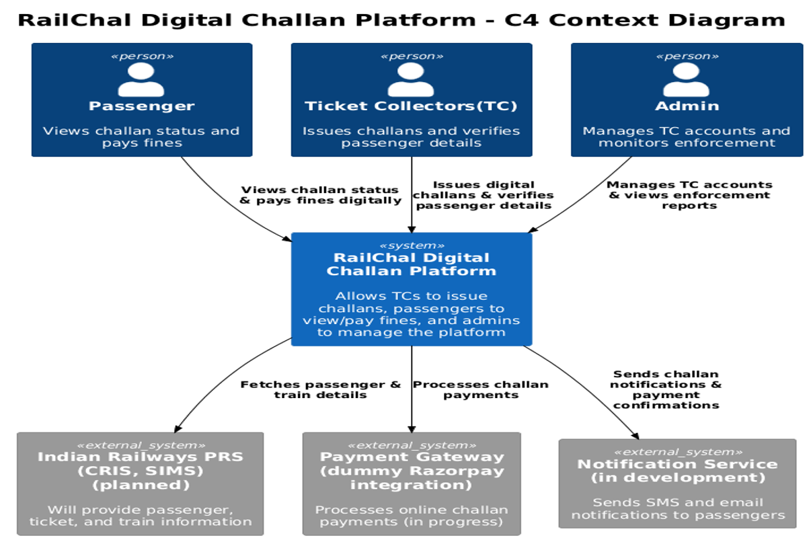
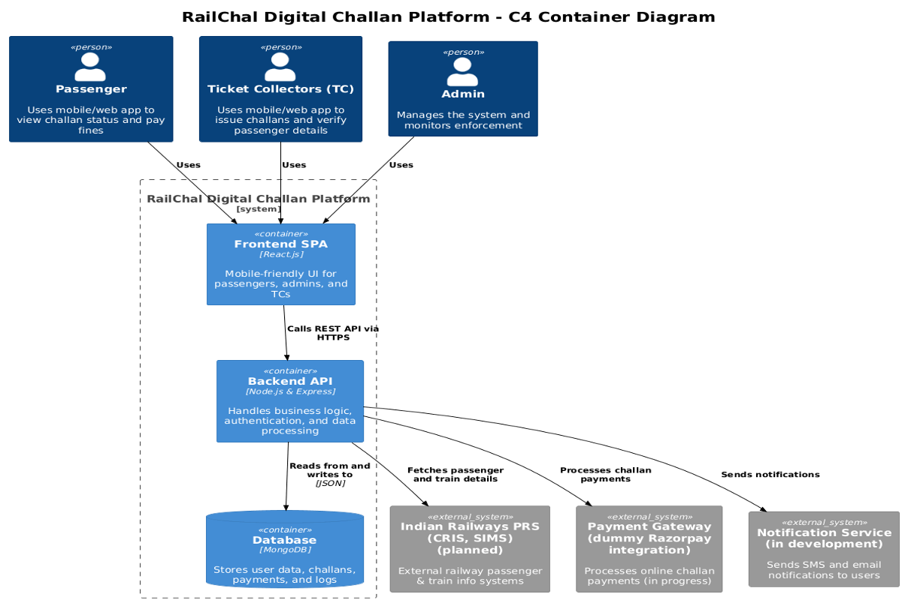
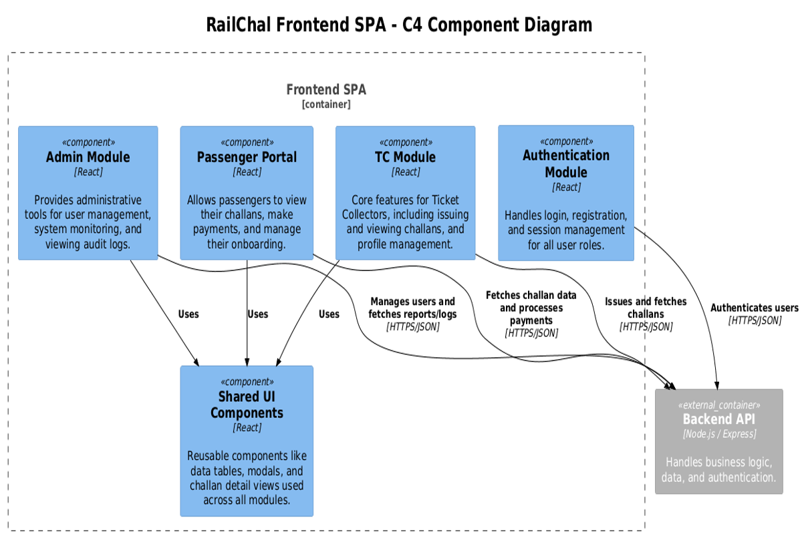
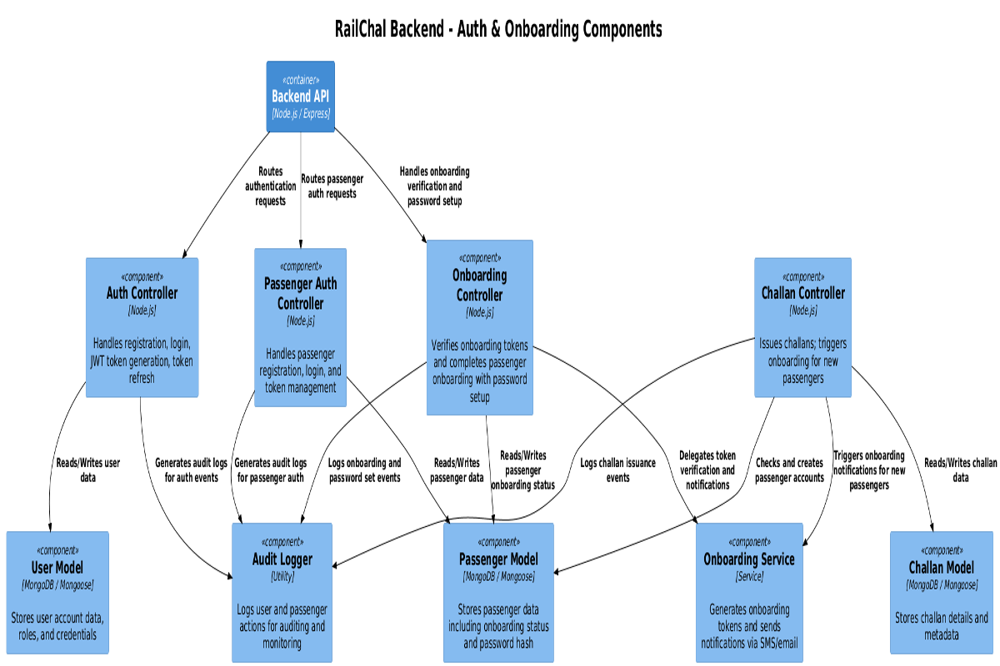

# RailChallan – Digital Railway Challan Platform

A production-ready, full-stack MERN application modernizing railway penalty issuance and management. Built with role-based access control, offline-first architecture, real-time analytics, and comprehensive audit trails to handle the complexity of field operations across Admin, Ticket Collector (TTE/TC), and Passenger workflows.

Live API Docs: https://ayushhh101.github.io/railway-challan-api-docs/

---

## Table of Contents
- [Highlights](#highlights)
- [Screenshots](#screenshots)
- [Architecture](#architecture)
- [Tech Stack](#tech-stack)
- [Features](#features)
- [API and Docs](#api-and-docs)
- [Security](#security)
- [Project Structure](#project-structure)

---

## ✨ Highlights

### Technical Excellence
- **Offline-First Architecture** – Resilient challan drafting with deferred sync for unreliable network conditions common in transit operations
- **Enterprise-Grade Security** – Role-based + object-level authorization, input validation, rate limiting, and security headers (Helmet)
- **Real-Time Analytics Dashboard** – Monthly trends, heatmaps, top performers, reason distribution, and recovery statistics for data-driven decisions
- **Automated PDF Generation** – Professional challan receipts with digital signatures and proof attachments
- **Intelligent Anomaly Detection** – Automated flagging of suspicious patterns and outlier activities for admin review

### Operational Features
- **Multi-Step Challan Workflow** – Guided wizard: passenger details → offense selection → fine calculation → signature capture → proof upload
- **Passenger Self-Service Portal** – Secure onboarding with token-based verification and challan history access
- **Comprehensive Audit Logging** – Full activity trail with actor tracking for compliance and accountability
- **Admin Control Center** – User management, audit reviews, anomaly resolution, and system-wide reporting
- **Partial Updates Support** – Granular profile field editing for TTEs to maintain accurate records

### Developer Experience
- 📚 **Complete OpenAPI/Swagger Documentation** – Interactive API explorer with realistic examples and consistent error schemas
- 🗂️ **Clean Architecture** – Well-organized monorepo with separation of concerns and reusable components
- 🌱 **Seeding Scripts** – Quick setup with pre-populated stations and test data

---
## Screenshots

Login Page 
---

## Architecture (High Level)

```
+---------------------------+        +----------------------------+
|        Frontend SPA       | <----> |        Backend API         |
|  React (Vite)             |  HTTPS |  Express / Node.js         |
|  Auth flows, dashboards   |        |  Auth, Challans, Reports   |
+-------------+-------------+        +---------------+------------+
              |                                      |
              v                                      v
      Local Storage (JWT)                    MongoDB (Users, Challans,
                                             Passengers, Audits, Anomalies)
```

### C4 Diagrams
Context: 
Containers (Platform): 
Backend Components: 
Frontend Components: 
Auth & Onboarding Flow: 

Key backend layers:
- routes/ → maps HTTP paths
- controllers/ → business logic
- middleware/ → auth, validation, uploads
- models/ → Mongoose schemas
- utils/ → audit logger, pdf, error helpers

Refer to /docs (C4 diagrams) for deeper component & context views.

---
## Tech Stack

**Frontend:** React + Vite, TailwindCSS, react-hot-toast, lucide-react  
**Backend:** Node.js, Express, Mongoose (MongoDB)  
**Other:** JWT Auth, Swagger (OpenAPI), Audit Logging, Seed script, C4 Architecture Diagrams  
**Planned / In‑progress:** Offline challan queue + later sync

---
## Notable Features

### Core
1. Digital Challan Issuing (multi‑step wizard: passenger details → offense → fine/payment meta → signature → proof upload).
2. Offline Challan Drafting & Deferred Sync  
   - TTE can fill challan steps when connectivity is poor.  
   - Draft kept locally (localStorage / in‑memory) until network returns.  
   - Pending drafts are marked and can be retried (prevents data loss in the field).  
   - On successful sync, local draft is cleared and standard audit events are recorded.  
3. Challan Management: filter, search, view detail, verify.
4. Passenger Onboarding & separate passenger auth flow.
5. PDF generation & download for each challan.
6. Proof image upload (file middleware + stored in /uploads/proofs).
7. Role-based auth (Admin / TTE / Passenger) with protected routes.
8. Admin Analytics: monthly trends, heatmap, top TTEs, reason distribution, recovery stats.
9. Audit Logging & Anomaly Tracking (suspicious or outlier activity surfaced to admins).
10. Partial Profile Field Updates (per‑field save for TTE profiles).
11. Station seeding script for fast setup.
12. Validation layer (shared middleware) and structured error responses.
13. Reusable UI components (modals, charts, inputs, signature pad).
14. Swagger OpenAPI documentation (public URL).

### Why the Offline Capability Matters (Resume Angle)
- Demonstrates resilience: maintains workflow in low connectivity (common in transit environments).
- Improves data integrity: avoids losing issued challans mid‑entry.
- Showcases forethought in UX + operational constraints.

---

## Monorepo Layout

```
railway-challan-app/
  backend/
  railway-challan-frontend/
  docker-compose.yml
  README.md
```

...